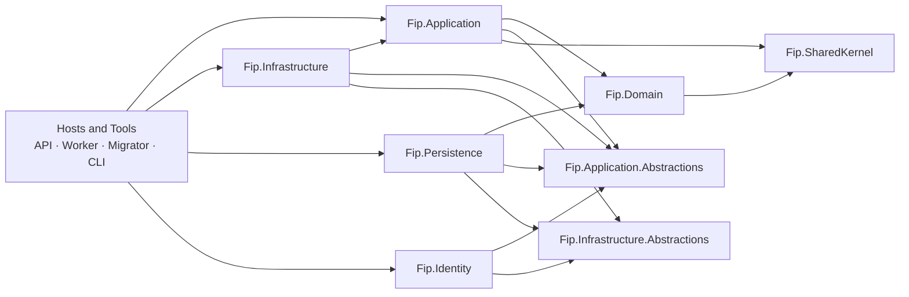

# Flight Intelligence Platform

Flight Intelligence Platform (FIP) is a .NET solution being built to ingest, normalize, analyze, and persist flight and telemetry data. The repository currently contains the initial layered structure and an implemented OpenSky JSON trajectory import path.

> FIP is an actively developed aviation technology portfolio project. This repository represents the public demonstration release. Continued development, additional integrations, and advanced analytical capabilities are maintained privately.

## Current capabilities

- Defines source-independent `Flight` and `FlightTelemetryPoint` domain models.
- Deserializes OpenSky trajectory JSON into `OpenSkyTelemetryPointDto` objects.
- Maps OpenSky telemetry into normalized FIP telemetry, including Unix-millisecond timestamp conversion and explicit unit names.
- Registers application, infrastructure, persistence, and identity composition roots.
- Provides an application-level flight trajectory import workflow from OpenSky JSON through validation, reconstruction, event detection, summary calculation, and persistence commit.
- Includes focused xUnit tests for the OpenSky importer, mapper, and import orchestration.

Aircraft and authentication remain scaffolds. The API exposes the initial read-only flight list and detail endpoints, and the first complete trajectory import application workflow is implemented for OpenSky JSON input.

## Architecture

The solution follows a layered structure with Core, BuildingBlocks, Infrastructure, Hosts, Tools, and tests. Domain code is source-independent. Application coordinates use cases and source-specific mapping. Infrastructure owns concrete file-based import behavior. Hosts compose the application for API, worker, migration, and CLI scenarios.



## Technology stack

- C# and .NET 10 (`net10.0`)
- SDK-style .NET projects
- ASP.NET Core Web SDK for the API host
- .NET Worker SDK for the worker host
- `System.Text.Json` for OpenSky deserialization
- Microsoft.Extensions dependency injection abstractions
- xUnit, Microsoft.NET.Test.Sdk, and coverlet for tests

EF Core 10 with SQL Server is configured for flight, telemetry, and event persistence. Database migrations are applied through the `Fip.DatabaseMigrator` host.

## Solution structure

- `src/BuildingBlocks` — shared kernel and application/infrastructure abstractions.
- `src/Core` — domain model and application layer.
- `src/Infrastructure` — concrete infrastructure, identity, and persistence projects.
- `src/Hosts` — API, worker, and database-migrator entry points.
- `src/Tools` — CLI entry point.
- `tests` — application, domain, infrastructure, and integration test projects.

See the [project structure](docs/project-structure.md) and [architecture](docs/architecture.md) documentation for details.

## Build and run

From the repository root:

```powershell
dotnet restore FIP.sln
dotnet build FIP.sln
dotnet test FIP.sln
```

Run the API host manually with:

```powershell
dotnet run --project src/Hosts/Fip.Api/Fip.Api.csproj
```

The API starts the host and exposes `GET /api/flights` and `GET /api/flights/{id}`. The default development launch settings use `http://localhost:5271` and `https://localhost:7219`.

For the normal local development workflow, open `FIP.sln` in Visual Studio, set `Fip.Api` as the startup project, and press `F5`. ASP.NET Core SPA Proxy automatically runs the Angular development server with `npm start`. Visual Studio opens the API bootstrap URL, then SPA Proxy redirects the browser to `http://localhost:4200`. The API runs under the debugger at `http://localhost:5271` (and `https://localhost:7219` when using the HTTPS profile), so C# breakpoints remain available. Angular hot reload remains enabled.

The first run requires `npm install` once in `apps/fip-web` if dependencies are not installed. To troubleshoot Angular separately, run it manually from `apps/fip-web`:

```powershell
cd apps/fip-web
npm install
npm start
```

It provides public Index, Features, Technology, Privacy, Terms, and Contact pages plus Flights and Flight Detail routes, and proxies `/api/...` requests to the local API.

## Development status

The repository is at an early foundation stage. OpenSky ingestion and telemetry normalization are the most complete functional path. The source-independent `Flight` aggregate, EF Core persistence, basic in-memory `FlightReconstructor`, telemetry validation classification, telemetry gap detection, initial `FlightEvent` domain model, conservative takeoff, Top-of-Climb, Top-of-Descent, and landing detectors, common event-detection orchestration, initial deterministic flight-phase classification, and first flight API endpoints are established. Other event detection algorithms, authentication, background import workflows, and production hardening remain to be implemented.

## Documentation

- [Architecture](docs/architecture.md)
- [Project structure](docs/project-structure.md)
- [Domain model](docs/domain-model.md)
- [Data import](docs/data-import.md)
- [Telemetry model](docs/telemetry-model.md)
- [Persistence](docs/persistence.md)
- [API](docs/api.md)
- [Development](docs/development.md)
