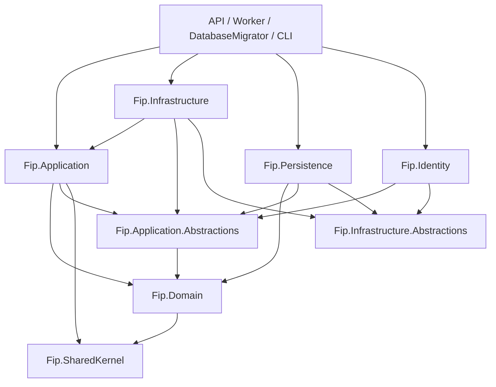

# Architecture

## Architectural style

FIP is organized as a layered .NET solution with separate Core, BuildingBlocks, Infrastructure, Host, Tool, and test areas. The codebase currently expresses the intended boundaries mostly through project references and namespaces; many projects remain skeletal.

The implemented OpenSky flow separates external transport shape from normalized domain data:

```text
OpenSky JSON
    -> OpenSkyJsonTrajectoryImporter (Infrastructure)
    -> OpenSkyTelemetryPointDto (Application)
    -> OpenSkyTelemetryMapper (Application)
    -> FlightTelemetryPoint (Domain)
    -> TelemetryPointValidator (Application)
    -> TelemetryValidationResult (Domain)
    -> TelemetryGapDetector (Application)
    -> TelemetryGap[] (Domain)
    -> FlightReconstructor (Application)
    -> Flight (Domain)
    -> FlightEvent (Domain, future detection)
    -> TakeoffDetector (Application)
    -> TopOfClimbDetector (Application)
    -> LandingDetector (Application)
    -> FlightEventDetectionService (Application)
    -> TopOfDescentDetector (Application)
    -> FlightPhaseClassifier (Application)
    -> FlightSummaryCalculator (Application)
    -> ImportFlightTrajectoryService (Application orchestration)
    -> FlightRepository (Persistence staging)
    -> UnitOfWork (Persistence commit)
    -> GeoDistanceCalculator (SharedKernel)
```

## Layers

### BuildingBlocks

`Fip.SharedKernel` contains the reusable `Entity` base class, an empty `ValueObject` base class, and the source-independent `IGeoDistanceCalculator`/`GeoDistanceCalculator` great-circle distance utility. `Fip.Application.Abstractions` contains the flight reconstruction, telemetry validation, telemetry gap, and common flight-event detection contracts along with contracts for repositories, unit of work, file storage, and time access. `Fip.Infrastructure.Abstractions` contains an empty `IInfrastructureService` contract.

### Core

`Fip.Domain` owns source-independent domain types. It currently contains `Flight`, `FlightEvent`, `FlightEventType`, `FlightTelemetryPoint`, `FlightPhase`, and `FlightPhaseSegment` and references only `Fip.SharedKernel`.

`Fip.Application` contains feature-oriented service shells, the source-independent `FlightReconstructor`, `FlightSummaryCalculator`, `TelemetryPointValidator`, `TelemetryGapDetector`, `TakeoffDetector`, `TopOfClimbDetector`, `LandingDetector`, `TopOfDescentDetector`, `FlightEventDetectionService`, `FlightPhaseClassifier`, the `ImportFlightTrajectoryService` use-case orchestrator, and the `FlightQueryService` read use case. It also contains DTOs, the OpenSky external DTO, the OpenSky importer interface, and the OpenSky-to-domain mapper. The import service coordinates the complete parse/normalize/validate/reconstruct/detect/summarize/persist workflow without owning those specialized algorithms. The flight query service maps persistence projections into API-safe DTOs without exposing domain aggregates.

### Infrastructure

`Fip.Infrastructure` contains concrete technical implementations. Its current implementation is `OpenSkyJsonTrajectoryImporter`, which asynchronously reads a file and deserializes an OpenSky JSON array. `AddInfrastructure` registers it against `IOpenSkyTrajectoryImporter`.

`Fip.Persistence` contains the EF Core database implementation, including `FipDbContext`, dedicated persistence entities and configurations, `FlightRepository`, and the scoped `UnitOfWork` implementation of the application-facing commit abstraction.

`Fip.Identity` contains only a DI extension and a placeholder services directory.

### Hosts and tools

- `Fip.Api` composes Application, Infrastructure, Persistence, and Identity and starts an ASP.NET Core host.
- `apps/fip-web` contains the standalone Angular frontend. A reusable root shell provides the sticky navigation and minimal footer around the public Index, Features, Technology, Flights, Flight Import, and Flight Detail routes. The Index page composes the dark FIP hero with the transparent `public/images/airframe-transparent.png` aircraft asset, live Recent Flights section, and flight-processing pipeline; reusable theme variables and the `FipIconComponent` SVG wrapper under `public/icons/fip/` support the rest of the application. It communicates with `Fip.Api` over HTTP/JSON through a development proxy.
- `Fip.Worker` creates a hosted worker whose `ExecuteAsync` currently completes immediately.
- `Fip.DatabaseMigrator` is an executable scaffold that prints that it is not configured.
- `Fip.Cli` is an executable scaffold that prints that it is not configured.

### Tests

The solution has separate xUnit projects for Application, Domain, Infrastructure, and Integration tests. Application and Infrastructure contain focused OpenSky tests. Domain and Integration currently contain only placeholder tests.

## Dependency direction

The declared project references are:



The Domain project does not reference Application, Infrastructure, OpenSky, or `System.Text.Json`. The hosts are composition roots and reference the layers they currently compose.

## Dependency injection

The API calls `AddApplication`, registers MVC controllers, then calls `AddInfrastructure`, `AddPersistence`, and `AddIdentity`. Application registers the scoped `IFlightQueryService` and `IImportFlightTrajectoryService` use cases alongside reconstruction, summary, validation, gap-detection, detector, event-orchestration, and phase-classification services. `FlightsController` delegates `GET /api/flights`, `GET /api/flights/{id}`, and `GET /api/flights/{id}/summary` to `IFlightQueryService`; the summary operation reuses `IFlightSummaryCalculator` after loading the full aggregate. Infrastructure registers `IOpenSkyTrajectoryImporter` to `OpenSkyJsonTrajectoryImporter` as a singleton. Persistence registers `FipDbContext` with SQL Server and the scoped `IFlightRepository` to `FlightRepository` and `IUnitOfWork` to `UnitOfWork`, using the `ConnectionString-AppDb` configuration key. Both persistence services consume the same scoped `FipDbContext`, so repositories stage changes and the unit of work commits them. Identity currently returns the service collection without registrations.
