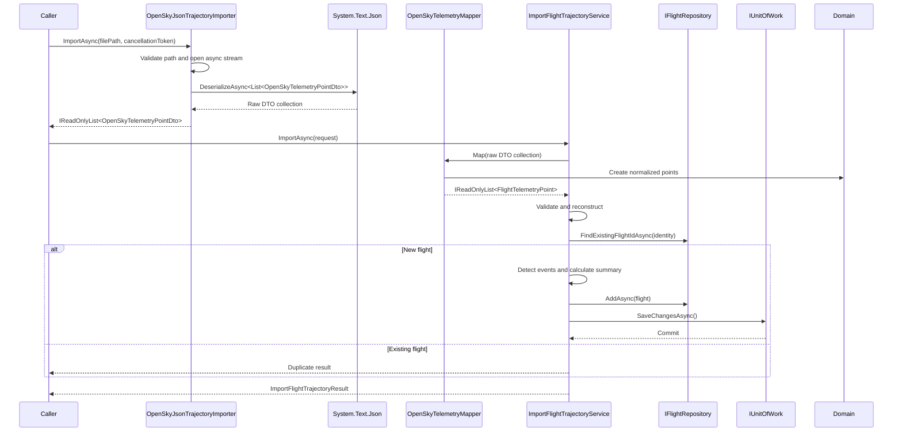

# Data import

## Current scope

The implemented import path supports an OpenSky trajectory represented as a JSON array of telemetry objects. The real-flight integration fixture is expected at `data/samples/opensky/TRA051_B738_2018-05-30.json`; the persistence `Data` directory contains only `.gitkeep`.

The importer accepts any compatible file path; it does not hard-code a sample path. The API upload endpoint accepts one `.json` file in multipart form, passes its stream to the application-neutral import overload, and does not write the upload to an arbitrary filesystem path.

## Pipeline

```mermaid
flowchart LR
    File[OpenSky JSON file path]
    Importer[OpenSkyJsonTrajectoryImporter\nInfrastructure]
    Raw[OpenSkyTelemetryPointDto\nApplication external DTO]
    Mapper[OpenSkyTelemetryMapper\nApplication]
    Normalized[FlightTelemetryPoint\nDomain normalized model]
    Workflow[ImportFlightTrajectoryService\nApplication orchestration]
    Validation[TelemetryPointValidator\nApplication]
    Reconstruction[FlightReconstructor\nApplication]
    Duplicate[Duplicate lookup\nIcao24 + StartTime + EndTime]
    Events[FlightEventDetectionService\nApplication]
    Summary[FlightSummaryCalculator\nApplication]
    Persistence[IFlightRepository + IUnitOfWork\nPersistence boundary]

    File --> Importer
    Importer --> Raw
    Raw --> Mapper
    Mapper --> Normalized
    Normalized --> Workflow
    Workflow --> Validation
    Validation --> Reconstruction
    Reconstruction --> Duplicate
    Duplicate -->|new flight| Events
    Duplicate -->|existing flight| Result[Duplicate result]
    Events --> Summary
    Summary --> Persistence
```



## Parsing

`OpenSkyJsonTrajectoryImporter` implements `IOpenSkyTrajectoryImporter` and uses `System.Text.Json.JsonSerializer.DeserializeAsync` to deserialize the entire JSON array into `List<OpenSkyTelemetryPointDto>`. The DTO uses `JsonPropertyName` attributes for `timestamp`, `icao24`, `latitude`, `longitude`, `groundspeed`, `track`, `vertical_rate`, `callsign`, and `altitude`.

The implementation uses asynchronous `FileStream` access with `useAsync: true`, `await using`, and the supplied `CancellationToken`.

## Input validation and errors

- Null, empty, or whitespace-only paths throw `ArgumentException`.
- Paths that do not exist throw `FileNotFoundException`.
- A null deserialization result is returned as an empty collection.
- `JsonException` is not swallowed, so malformed JSON reaches the caller.
- API-level upload validation rejects missing, empty, non-JSON, or unsupported-content-type uploads before application processing.
- No aviation-behavior validation is performed.

## Mapping and normalization

`OpenSkyTelemetryMapper` maps a raw DTO to `FlightTelemetryPoint`. It converts the OpenSky Unix timestamp from milliseconds with `DateTimeOffset.FromUnixTimeMilliseconds`. The current mapper preserves source numeric values while expressing their normalized names as `AltitudeFeet`, `GroundSpeedKnots`, `TrackDegrees`, and `VerticalRateFeetPerMinute`. Callsigns are trimmed; numeric nulls remain null.

The `ImportFlightTrajectoryService` owns the application workflow. It excludes invalid points, retains suspicious points with validation issues as warnings, reconstructs the flight, checks the reconstructed `ICAO24 + StartTime + EndTime` identity, and only for a new flight attaches chronologically detected events, calculates the summary, stages the aggregate through `IFlightRepository`, and commits through `IUnitOfWork`. A matching flight returns a `Duplicate` result with the existing flight ID and zero newly imported points/events. Specialized services retain responsibility for parsing, validation, reconstruction, event detection, and summary calculation.

`POST /api/flights/import` maps a new `Imported` result to `201 Created` and an existing `Duplicate` result to idempotent `200 OK`. The controller does not call persistence or commit independently; the application import service owns the existing unit-of-work commit boundary.

## Successful result

After the persistence commit succeeds, the service returns an immutable `ImportFlightTrajectoryResult` containing application-level flight identity, compatibility warnings, and `FlightImportDiagnostics`. Diagnostics are returned only for now; no import-history table is introduced in this step.

```text
FlightId: 00000000-0000-0000-0000-000000000000
Callsign: TRA051
ICAO24: 484506
PointsImported: 120
StartTime: 2018-05-30T10:00:00+00:00
EndTime: 2018-05-30T11:30:00+00:00
EventsDetected: 4
Warnings:
  - 2 invalid telemetry points were excluded.
Diagnostics:
  Source: OpenSky
  Filename: TRA051_B738_2018-05-30.json
  RecordsRead: 120
  RecordsRejected: 2
  Duration: 00:00:00.120
```

The result also contains `Status`, which is `Imported` for a newly persisted flight or `Duplicate` when the reconstructed identity already exists. Duplicate operations do not call event detection, summary calculation, repository add, or unit-of-work commit.

The values above illustrate the result shape only; counts, timestamps, and duration are determined by the imported trajectory. `RecordsRead` is the parsed source collection count. `RecordsRejected` counts invalid records excluded by telemetry validation; suspicious records remain accepted and generate an aggregated warning. A clean import returns an empty, non-null warning collection.

## Test coverage

Infrastructure tests use temporary JSON files and cover populated fields, nullable fields, empty arrays, missing files, and malformed JSON. Application tests cover timestamp conversion, callsign trimming, normalized field mapping, null preservation, and collection order. The tests do not depend on the large repository sample file.

The `Tra051ImportIntegrationTests` test uses the repository fixture `data/samples/opensky/TRA051_B738_2018-05-30.json` as the first real-flight end-to-end integration fixture. It protects the complete OpenSky parsing, normalization, telemetry validation, reconstruction, event-detection, summary, and import-result pipeline against regressions without requiring internet access or a database.

## Sequence


